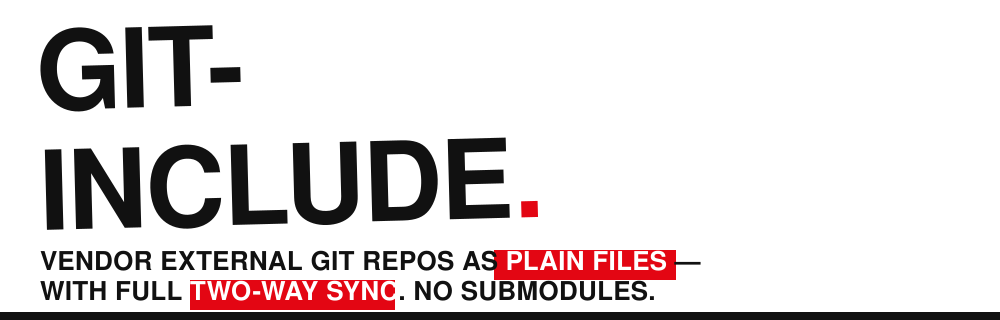

<p align="center">
  
</p>

<p align="center">
  <b>English</b> | <a href="README.zh-CN.md">中文</a>
  <br><br>
  <a href="https://github.com/flova/git-include/actions/workflows/ci.yml"></a>
  <a href="LICENSE"></a>
  
</p>

`git-include` is a modern alternative to submodules and
[git-subrepo](https://github.com/ingydotnet/git-subrepo). It inlines an
upstream repository together with a small marker file into a subdirectory of
your repository. That's the whole model:

- **Collaborators need nothing.** They `git clone` and get working code. No
  `--recursive`, no `submodule update`, no git-include installation required.
  Only the person syncing with upstream needs the tool.
- **Two-way sync.** `git include pull` merges new upstream work into your tree;
  `git include push` rebuilds upstream history from your commits — each host
  commit that touched the directory becomes an individual upstream commit
  with its original message and author (even commits made before a pull),
  and the marker file never leaks upstream.
- **git-subrepo compatible.** The marker file is the same `.gitrepo` format.
  You can adopt a repository that already uses git-subrepo with zero
  migration.
- **Export built in.** `git include init` turns any ordinary directory into
  a new included repository, extracting its full history from your commits —
  ready to push to its own (even empty) repository.
- Painless **branch switching**, quick **status/diff against upstream**,
  **nested includes**, and **tab completion** out of the box.

```console
$ git include add https://github.com/example/widgets vendor/widgets
$ git include status
$ git include pull vendor/widgets      # get new upstream work
$ git include push vendor/widgets      # contribute your changes back
```

---

## Table of contents

- [Why not submodules / subtree / subrepo?](#why-not-submodules--subtree--subrepo)
- [Installation](#installation)
- [Tab completion](#tab-completion)
- [Quickstart](#quickstart)
- [Command reference](#command-reference)
- [Migrating away from submodules](#migrating-away-from-submodules)
- [Pinning to tags and commits](#pinning-to-tags-and-commits)
- [Custom commit messages](#custom-commit-messages)
- [The `.gitrepo` marker file](#the-gitrepo-marker-file)
- [Git LFS](#git-lfs)
- [Exporting a directory into its own repository](#exporting-a-directory-into-its-own-repository)
- [Nested includes](#nested-includes)
- [Handling merge conflicts](#handling-merge-conflicts)
- [How it works](#how-it-works)
- [FAQ](#faq)
- [Development](#development)

---

## Why not submodules / subtree / subrepo?

Submodules make every collaborator pay (extra tooling, `--recursive`,
detached-HEAD surprises); subtree pollutes your history with merge noise
and hides its state in ways that are hard to inspect; both leave common
tasks — "diff against upstream", "switch the tracked branch", "what's not
pushed yet?" — awkward or impossible.

The fundamental idea here is the same as git-subrepo: **the vendored code is just
files in your repository**, and a marker file records where they came from and
which upstream commit they correspond to. Everything else — merging, pushing,
diffing — is derived from that.

Compared to git-subrepo, git-include is a compiled binary (built on libgit2
via the `git2` crate) in Rust — a strongly typed language with compile-time
guarantees — rather than bash, and never creates temporary branches,
worktrees, or clones in your repository: your branches and your working
tree stay untouched except for the one subdirectory being operated on.
The CLI is more intuitive; pinning to a specific tag or commit (not
just a branch) is supported, along with Git LFS and migrating existing
submodules directly.

## Installation

**Linux / macOS — one-liner:**

```console
$ curl -fsSL https://raw.githubusercontent.com/flova/git-include/main/install.sh | bash
```

The script detects your platform, downloads the latest release binary,
verifies it against the release's `SHA256SUMS` manifest, and installs it to
`~/.local/bin` (or `/usr/local/bin` as root). For Linux, two flavors are
published and the script picks automatically (override with
`GIT_INCLUDE_FLAVOR=dynamic|portable`):

- `*-linux-gnu` — dynamically linked against your distro's OpenSSL and
  zlib; nothing bundled. Preferred when the system is compatible.
- `*-linux-gnu-portable` — OpenSSL and zlib **compiled in**; needs only
  glibc ≥ 2.28 (2018), so it runs on old distros and slim container
  images with no libssl. (Musl-based distros like Alpine build from
  source — see below.)

macOS binaries use the system Security framework for TLS; OpenSSL is
compiled in only for SSH support (macOS ships no OpenSSL to link
against). You can also just grab the binary for your platform from the
[releases page](https://github.com/flova/git-include/releases) directly. Pin a version
with `GIT_INCLUDE_VERSION=v0.1.0`, change the directory with
`GIT_INCLUDE_BIN_DIR`. Update any time — the binary updates itself:

```console
$ git include self-update            # or --version vX.Y.Z, or -n to preview
```

(Self-update downloads are checksum-verified against the release's
`SHA256SUMS` before the running binary is replaced.)

(Self-update is only compiled into the binaries git-include distributes
itself — the curl-installed ones and the Windows MSI. Package-manager
builds like conda disable it via a cargo feature flag.)

**Windows:** download the MSI installer (x64) from the
[latest release](https://github.com/flova/git-include/releases/latest) —
it installs `git-include.exe` and puts it on `PATH`. On ARM64 Windows,
grab `git-include-aarch64-pc-windows-msvc.exe` from the release assets
instead and place it on your `PATH`. (`self-update` works on Windows
too, for both architectures.)

**Conda:** install from [conda-forge](https://conda-forge.org) with
`conda install -c conda-forge git-include` (linux-64, linux-aarch64,
osx-arm64 and win-64). There are no prebuilt Intel-Mac packages or
binaries — Intel Mac users build from source (see below). Conda builds
are compiled without the self-update mechanism — there, updating is
conda's job (`conda update git-include`), and `git include self-update`
says so instead of fighting the package manager.

**From source** (needs a current stable Rust; libgit2 is vendored and
compiled in, so there is no system dependency beyond OpenSSL on Linux):

```console
$ cargo install --git https://github.com/flova/git-include   # straight from GitHub
$ cargo install --path .                                     # from a checkout
```

The binary is named `git-include`, so git automatically picks it up as a
subcommand: `git include <command>`. Verify with:

```console
$ git include --version
```

## Tab completion

Generate a completion script for your shell and source it from your shell
configuration:

```console
# bash — completes both `git-include <TAB>` and `git include <TAB>`,
# including live completion of included directories and branch names
$ git include completions bash > ~/.local/share/bash-completion/completions/git-include

# zsh — place on your $fpath; zsh's git completion dispatches automatically
$ git include completions zsh > ~/.zfunc/_git-include

# fish
$ git include completions fish > ~/.config/fish/completions/git-include.fish
```

Elvish and PowerShell are also supported (`git include completions --help`).

## Quickstart

### Vendor a repository

```console
$ git include add https://github.com/example/widgets vendor/widgets
No branch given; using upstream default branch 'main'.
Fetching https://github.com/example/widgets (main) ...
Added 'vendor/widgets' from https://github.com/example/widgets (branch main, commit 1a2b3c4).
```

This creates **one commit** in your repository containing the full upstream
tree under `vendor/widgets/` plus `vendor/widgets/.gitrepo`. From here on the
directory is completely ordinary: edit it, commit to it, revert it, bisect
through it — it's just files.

### See where you stand

```console
$ git include status --fetch
vendor/widgets
  remote:   https://github.com/example/widgets
  branch:   main (synced at 1a2b3c4)
  upstream: 2 new commit(s) available -> `git include pull vendor/widgets`
  local:    1 commit(s) to push -> `git include push vendor/widgets`

$ git include diff vendor/widgets              # your changes since last sync
$ git include diff vendor/widgets --upstream --fetch   # vs. latest upstream
```

`diff` output is colorized like `git diff` when writing to a terminal
(disable with the standard `NO_COLOR` environment variable).

Without `--fetch`, `status` uses the upstream state seen by the most recent
fetch, so it's instant and works offline.

### Pull upstream changes

```console
$ git include pull vendor/widgets
```

Your local changes to the directory (if any) are three-way merged with the
upstream changes, exactly like a `git merge` — including content-level merges
and conflict markers when both sides touched the same lines. The result is a
single commit in your repository. `git include pull --all` syncs every
included directory; with a single include, plain `git include pull` suffices.

When the directory's local state is beyond saving, `git include pull
--force` discards it — committed or not — and takes upstream verbatim.
Force-discarded changes are also excluded from future pushes.

### Push your changes upstream

```console
$ git include push vendor/widgets
Pushed 2 commit(s) from 'vendor/widgets' to https://github.com/example/widgets (main); upstream is now 9f8e7d6.
```

`push` rebuilds the upstream history as a **1:1 image of your host
commits**: every commit that changed the directory since your changes were
last incorporated upstream becomes its own upstream commit — original
message, original author, containing only the directory's files. Branches
and merges are mirrored exactly as they happened in the host repository
(a host merge that resolved conflicting branch edits arrives as the same
merge commit, carrying the same resolution); commits that never touched
the directory are left out. This works **across pulls**: commits made
before a pull stay individual commits, based on the upstream state they
were actually written against, and the pull itself becomes an ordinary
merge with upstream's own history. The commit hashes necessarily differ
from your host commits, but content and topology are preserved exactly.
The `.gitrepo` marker is stripped automatically and never appears
upstream.

Preview with `git include push -n <dir>`; use `--squash` if you'd rather
publish everything as a single commit.

If upstream moved in the meantime, `push` refuses and asks you to
`git include pull` first, so upstream never gets surprise merge results.

Pushes can also target a **different branch and/or remote** — a feature
branch, or a fork:

```console
$ git include push vendor/widgets --branch feature/my-fix
$ git include push vendor/widgets --remote git@github.com:me/widgets-fork -b pr/fix --keep
```

By default the include is **retargeted** to where the push went (the
marker records the new remote/branch, and future pulls follow it). Pass
`--keep` for the temporary-fork flow: the push happens, but the marker
keeps tracking the original revision — once the proposal is merged
upstream, a normal `pull` picks it up. Both work from an include pinned
to a tag or commit (pass `--branch` to name the target). An existing
target branch is only accepted at the recorded base, so unrelated work is
never clobbered.

`pull` and `switch` accept `--remote <url>` as well — pulling always
retargets the marker to the remote it pulled from. That also makes
`pull --remote` the way to follow an upstream that moved: pulling from
the new location retargets the include even when its content is
unchanged.

### Switch the tracked branch

```console
$ git include branches vendor/widgets
* main (1a2b3c4)
  next (5d6e7f8)

$ git include switch vendor/widgets next
Switched 'vendor/widgets' to branch next (commit 5d6e7f8).
```

Local changes are carried over (merged) when switching; a clean directory is
simply swapped to the new branch's content. Switching back is the same
command again. `switch` also accepts a tag or commit id — see
[Pinning to tags and commits](#pinning-to-tags-and-commits).

## Command reference

| Command | Description |
| --- | --- |
| `git include add <remote> <dir> [-b <branch> \| -t <tag> \| --commit <sha>]` | Vendor an upstream repository into `<dir>`, tracking a branch (default: the remote's default branch) or pinned to a tag/commit. |
| `git include pull [<dir>] [--all] [--force] [-r <url>]` | Merge new upstream commits into `<dir>` (or all includes); `--force` discards local changes, `-r` pulls from (and retargets to) another remote. |
| `git include push <dir> [-n] [-b <branch>] [-r <url>] [--keep] [--squash]` | Replay local commits touching `<dir>` onto the upstream branch and push; `-b`/`-r` push (and retarget) elsewhere, `--keep` keeps the current tracking. |
| `git include status [<dir>] [-f/--fetch]` | Show sync state: commits available upstream, commits to push, uncommitted edits. |
| `git include diff <dir> [--upstream] [--stat] [-f/--fetch]` | Diff `<dir>` against the last-synced commit, or against the latest upstream head. |
| `git include switch <dir> <branch\|tag\|commit>` `[-r <url>]` | Track a different branch, or pin to a tag/commit, carrying local changes over; `-r` switches the remote too. |
| `git include branches <dir>` | List upstream branches and tags, marking the tracked revision. |
| `git include migrate [<path>...]` | Convert git submodules into includes — all of them, or just the given paths. |
| `git include list` | List all includes, nested ones indented. |
| `git include remove <dir>` | Delete an include from the working tree (history and upstream untouched). |
| `git include completions <shell>` | Print a tab-completion script. |
| `git include self-update [--version <tag>]` | Update the git-include binary to the latest (or a specific) release. |

All `<dir>` arguments are relative to your current directory, so the commands
work from anywhere inside the repository. `--no-lfs` is accepted by `add`,
`pull`, `push` and `switch` to skip LFS transfers; `-m/--message` is
accepted by every command that creates a sync commit (see
[Custom commit messages](#custom-commit-messages)).

## Migrating away from submodules

One command turns a submodule-based repository into an include-based one:

```console
$ git include migrate                # convert every submodule
$ git include migrate vendor/lib     # or just this one
Migrating submodule 'vendor/lib' (recorded commit 1a2b3c4) ...
Migrated 'vendor/lib' -> include of https://github.com/example/lib pinned to commit 1a2b3c4.
```

Each submodule becomes an include **pinned to the exact commit the
submodule recorded**, so the migration never changes your tree's content
— one commit per submodule, converting the gitlink into plain files with
a `.gitrepo` marker. `.gitmodules` entries are removed (the file is
deleted once empty), and the submodule's leftover `.git/modules` clone
and `submodule.*` config are cleaned up. Afterwards, switch any include
from its pin to a living branch with `git include switch <dir> <branch>`.

## Pinning to tags and commits

Unlike git-subrepo, an include does not have to track a branch — it can be
pinned to an exact upstream state:

```console
$ git include add https://github.com/example/widgets vendor/widgets --tag v2.1.0
$ git include add https://github.com/example/parser  vendor/parser  --commit 9f8e7d6c...
$ git include switch vendor/widgets v2.2.0     # move between releases
$ git include switch vendor/widgets main       # back to tracking a branch
```

`switch` resolves its argument automatically (branch first, then tag, then
commit id), so moving between releases and branch-tracking is one command
either way. A pinned include is fully reproducible: `pull` reports the pin
instead of moving, `status`/`diff` compare against the pinned state, and
`push` refuses with a pointer to `switch` (there is no branch to push to).
Local edits are carried over when switching — or discarded with
`switch --force`.

## Custom commit messages

The messages of the sync commits git-include creates (add, pull, switch,
push bookkeeping, init, remove) are templatable with Jinja (via
[minijinja](https://crates.io/crates/minijinja)) — variables, filters and
conditionals all work:

```console
# per repository (or --global), for all sync commits:
$ git config include.commitTemplate 'chore(vendor): {{ action }} {{ subdir }} @ {{ short_commit }}'

# or per invocation:
$ git include pull vendor/widgets -m 'vendor: update widgets to {{ short_commit }}'

# full Jinja expressions are available:
$ git include pull vendor/widgets \
    -m '⬆ {{ subdir | upper }} @ {{ short_commit }}'
```

| Variable | Value |
| --- | --- |
| `{{ action }}` | the command, including notable flags (e.g. `pull --force`) |
| `{{ subdir }}` | the included directory |
| `{{ remote }}` | upstream URL |
| `{{ ref }}` (alias `{{ branch }}`) | the tracked branch/tag/commit |
| `{{ ref_kind }}` | `branch`, `tag`, or `commit` |
| `{{ commit }}` / `{{ short_commit }}` | the upstream commit (full / 7 chars) |
| `{{ version }}` | the git-include version |

The literal sequence `\n` becomes a newline, so multi-line messages fit in
a single-line config value. A broken template (syntax error or unknown
variable) prints a warning and falls back to the default message — a
finished sync is never aborted over a typo. Without a template,
git-include writes its default structured message
(`git include <action> <dir>` plus a metadata block).

## The `.gitrepo` marker file

Each included directory contains a `.gitrepo` file in git-subrepo's format:

```ini
; DO NOT EDIT (unless you know what you are doing)
;
[subrepo]
	remote = https://github.com/example/widgets
	branch = main
	commit = 1a2b3c4d...   ; upstream commit the directory was last synced to
	parent = 9z8y7x6w...   ; last host commit whose changes are already upstream
	method = merge
	cmdver = git-include/0.1.0
```

Because the format, keys and semantics match git-subrepo, adopting
git-include in an existing git-subrepo project requires no migration at
all: it operates on directories vendored with `git subrepo clone` as-is.
The reverse direction works for branch-tracking includes, but note that
git-subrepo has no notion of pinning to a tag or commit — an include
using those features has no git-subrepo equivalent.

The `cmdver` field records the tool that last wrote the marker.
git-include namespaces its value (`git-include/<version>`) so it is never
mistaken for a git-subrepo version number, while git-subrepo keeps writing
its own bare version there — each tool reads and preserves the other's
value untouched.

## Git LFS

If the upstream repository uses Git LFS, git-include notices (via
`filter=lfs` in its `.gitattributes`) and handles it automatically:

- **add / pull / switch** fetch the LFS objects from the *upstream* LFS store
  and materialize real content in your working tree,
- **push** uploads LFS objects referenced by your commits *before* pushing the
  git objects, so upstream never sees dangling pointers,
- if `git-lfs` is not installed, operations still succeed — you get pointer
  files plus a clear warning with the exact commands to run later,
- `--no-lfs` skips all of it.

## Exporting a directory into its own repository

The reverse of `add`: a directory that grew inside your repository can
graduate into a repository of its own, history included.

```console
$ git include init mylib --remote git@github.com:me/mylib.git
Extracting the history of 'mylib' ...
Turned 'mylib' into an included repository: extracted 17 commit(s) of history (head 3fc9a21).
Publish it with: git include push mylib

$ git include push mylib
Published 'mylib' to git@github.com:me/mylib.git as new branch 'main'.
```

`init` (alias: `export`) walks your entire history, and every commit that
changed the directory becomes a commit of a brand-new standalone history —
original author and message, content filtered to the directory (a commit
that touched both `mylib/` and other files contributes only its `mylib/`
part). `push` then publishes that history, creating the branch on an empty
remote if needed. From that moment the directory is a normal include:
others can `git include add` it, and `pull`/`push`/`status` work as usual.

## Nested includes

Included repositories can themselves contain includes. Since everything is
plain files, the inner `.gitrepo` markers travel along automatically:

```console
$ git include add https://github.com/example/app libs/app
$ git include list
libs/app  <-  https://github.com/example/app (main @ 4ee9c11)
  libs/app/vendor/parser  <-  https://github.com/example/parser (main @ 77af0d3)
```

You can operate on any level: `git include pull libs/app` syncs the outer
repository (bringing whatever state of `vendor/parser` it has committed),
while `git include pull libs/app/vendor/parser` syncs the inner one directly
from *its* upstream. When pushing an include, only its own marker is stripped —
nested markers are content and are pushed intact.

## Handling merge conflicts

When both you and upstream changed the same lines, `pull` stops with the
conflicting files left in your working tree containing standard conflict
markers:

```console
$ git include pull vendor/widgets
CONFLICT: could not automatically merge upstream changes into 'vendor/widgets'.
Files with conflict markers:
  vendor/widgets/src/lib.rs

Resolve the conflicts, then finish with:
  git add vendor/widgets
  git commit
```

There is no special "continue" state to manage: resolve the markers, `git add`,
`git commit` — done. (The `.gitrepo` update is already staged for you.) If you
want to bail out instead, `git reset --hard` restores the pre-pull state.

## How it works

Every operation is a pure function of the four marker values (`remote`,
`branch`, `commit`, `parent`) plus the current state of the host repository
and the upstream remote — there is no state in `.git/config`, no registered
remotes, no temporary branches. All of it runs in-process through libgit2
(the `git2` crate):

- `add` fetches the upstream branch and grafts its tree under the prefix by
  rewriting the root tree — one commit, no shared history with upstream.
- `pull` takes three trees — the last-synced upstream commit's tree (base),
  your current directory tree (ours), and the new upstream head's tree
  (theirs) — and hands them to libgit2's three-way merge (rename detection
  included). A clean merge becomes a single host commit; conflicts are
  materialized in your working tree with standard conflict markers.
- `push` first verifies the upstream branch still points at the recorded
  base (so the result is a pure fast-forward upstream, never a surprise
  merge), then maps each host commit that changed the directory to an
  upstream commit — subdirectory tree taken verbatim with the marker
  stripped, original message and author, and the host parents translated to
  their upstream images, so branching and merging carry over unchanged.
  Marker-only bookkeeping commits are skipped automatically, and sync
  commits map to the upstream commit they took (a pull that merged local
  work becomes a real merge with upstream). Only the include's *own* marker
  is stripped; nested `.gitrepo` files are content and travel upstream
  intact.
- Fetched upstream heads are pinned under `refs/include/<dir>` so `status`
  and `diff` work offline and fetched objects survive `git gc`.

One subtle case is handled explicitly: a fresh clone of the host repository
has the vendored *trees and blobs* (they're reachable from host commits)
but not the upstream *commit* objects. Syncing commands therefore re-fetch
from the upstream remote on demand, and detect upstream history rewrites
(force-pushes) with a clear recovery path instead of producing a bogus
merge.

No temporary branches, no `.git/modules`, no stashing, no touching your
working tree outside the included directory — and unlike git-subrepo, no
dependency on `git subtree`-style squash-merge machinery.

## FAQ

**Do my collaborators need git-include?**
No. The vendored directory is regular files. Only whoever runs
`pull`/`push`/`switch` needs the tool.

**Does `add` bloat my repository?**
You get the upstream *tree* (one snapshot), not its history, in your branch.
The fetched upstream history stays in your local object store for merging but
is never pushed to your host remote.

**Can I edit vendored files directly?**
Yes — that's the point. Commit as usual; `git include status` shows what
hasn't been pushed upstream yet.

**What if upstream force-pushed?**
`pull` and `push` detect that the recorded commit no longer exists upstream
and tell you how to recover.

**Which git version do I need?**
Any — git-include embeds libgit2 and talks to remotes itself, so it works
independently of the git version installed on the machine. The only
optional external dependency is `git-lfs` for LFS content, and your
credentials are picked up the standard way (ssh-agent and git credential
helpers).

## Development

The development and release environment is pinned with
[pixi](https://pixi.sh) — one command gets you the exact Rust toolchain,
git-lfs and C compiler the project is built and tested with (versions
locked in `pixi.lock`):

```console
$ pixi run test               # full test suite, LFS round-trip included
$ pixi run lint               # rustfmt + clippy, exactly as CI runs them
$ pixi run build              # release binary for your platform
```

The test suite is extensive: it exercises two-way sync, nested includes,
Git LFS, submodule migration, and edge cases like conflicting concurrent
branches end-to-end against real git repositories, and runs in CI on
every change.

There is no separate toolchain setup — development, CI and releases all
build through pixi. Releases are built by CI from a `v*` tag, entirely
with the pixi-pinned toolchain (the `dist` environment — no rustup, no
system packages); the release workflow can also be dispatched manually
as a dry run that produces all artifacts without publishing anything.

## License

MIT — see [LICENSE](LICENSE).
